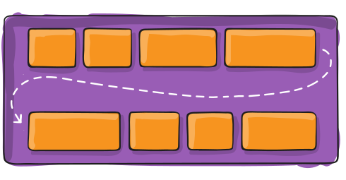

# Instructions
To install node dependencies
```
  $> npm-install
```

To initialize the project 
```
  $> npm run initialize
```

To run local server with scss compilation watch 
```
  $> npm run hard-live
```


# html-css
HTML and CSS3 lessons
# design url
<https://zpl.io/bAoEqPP>
# SEMANTIC HTML
# HTML
<https://www.w3schools.com/html/>
# HTML SEMÁNTICO
<https://www.w3schools.com/html/html5_semantic_elements.asp>

# ETIQUETAS ANTERIORES
- h1, h2, h3, h4, h5, h6…
- div
- P
- ul > li
- a
- span
- button
- table > tr > td

# ETIQUETAS SEMÁNTICAS
- main
- header
- nav
- section
- article
- figure
- figcaption
- time
- mark
- footer

# ELEMENTOS DE FORMULARIO
- form
  - novalidate
- fieldset
- legend
- input
  - required
  - type
    - text
    - url
    - email
    - password
    - checkbox
    - radio
    - textarea
  - pattern
  - min / max
  - maxlength

# ITCSS (Scalable and maintenable css arquitecture)


- Seetings: Utiliza preprocesadores y contiene fuentes, definiciones de color y configuraciones generales.
- Tools: mixins y funciones, no deberían contener estilos.
- Generic: capa donde reseteamos y normalizamos estilos. Primera capa con css.
- Elements: Estilos base para elementos html y redefinición del predeterminado del navegador.
- Objects: Selectores basados ​​en clases que definen patrones de diseño no decorados.
- Components: Componente UI específicos. Aquí es donde tendremos el grueso de nuestros proyectos con los componentes desarrollados para nuestras necesidades.
- Utilities: Utilidades y clases de ayuda que pueden sobrescribir cualquier definición anterior en el triángulo.

Ésta arquitectura nos dará como resultado estilos que van desde lo general a lo explicito, de poco a muy específico (sin llegar a utilizar la especifidad de ID, ya que no está contemplada) y de largo alcance a localizado.


# BEM (Block Element Modifier)
```
  $> .block
```


```
  $> .block__element
```


```
  $> .block--modifier
```
```
  $> .block__element--modifier
```


# UNIDADES RELATIVAS - REM

Trasladar unidades rem a valor de pixel se determina por el tamaño de la fuente del elemento html. Éste tamaño de fuente es influenciado por la herencia del ajuste del tamaño de fuente del navegador a menos de que explícitamente se sobreescriba con una unidad no sujeta a herencia. 

La mayor potencia que las unidades rem ofrecen no es solo que dan consistencia al tamaño sin importar la herencia del elemento, nos dan una forma de que los ajustes del tamaño de la fuente del usuario tengan influencia en cada aspecto del maquetado de un sitio.

Pero al usar unidades rem, si un usuario incrementa el tamaño de su fuente, la integridad del maquetado se preservará,  y el texto no se encogerá en un espacio rígido preparado para un texto más pequeño.

# SELECTORES CSS3

<https://www.w3schools.com/css/css_pseudo_classes.asp>

<https://developer.mozilla.org/es/docs/Web/CSS/Pseudo-classes>


## PSEUDOELEMENTOS

- ::first-line: selecciona la primera línea del texto de un elemento.
- ::first-letter: selecciona la primera letra del texto de un elemento.
- ::before: selecciona la parte anterior al contenido de un elemento para insertar nuevo contenido generado.
- ::after: selecciona la parte posterior al contenido de un elemento para insertar nuevo contenido generado.
- ::selection: selecciona el texto que ha seleccionado un usuario con su ratón o teclado.
	

## SELECTORES DE ATRIBUTO

- elemento[atributo^="valor"]: selecciona todos los elementos que disponen de ese atributo y cuyo valor comienza exactamente por la cadena de texto indicada.
- elemento[atributo$="valor"]: selecciona todos los elementos que disponen de ese atributo y cuyo valor termina exactamente por la cadena de texto indicada.
- elemento[atributo*="valor"]: selecciona todos los elementos que disponen de ese atributo y cuyo valor contiene la cadena de texto indicada.
  - 
## SELECTOR DE HERMANOS
- selector general de elementos hermanos:
  - h1 + h2 { ... }  /* selector adyacente */
  - h1 ~ h2 { ... }  /* selector general de hermanos */

- elemento:nth-child(numero): selecciona el elemento indicado pero con la condición de que sea el hijo enésimo de su padre. Este selector es útil para seleccionar el segundo párrafo de un elemento, el quinto elemento de una lista, etc.
- elemento:nth-last-child(numero): idéntico al anterior pero el número indicado se empieza a contar desde el último hijo.
- elemento:empty: selecciona el elemento indicado pero con la condición de que no tenga ningún hijo. La condición implica que tampoco puede tener ningún contenido de texto.
- elemento:first-child y elemento:last-child: seleccionan los elementos indicados pero con la condición de que sean respectivamente los primeros o últimos hijos de su elemento padre.
- elemento:nth-of-type(numero): selecciona el elemento indicado pero con la condición de que sea el enésimo elemento hermano de ese tipo.
- elemento:nth-last-of-type(numero): idéntico al anterior pero el número indicado se empieza a contar desde el último hijo.
- li:nth-child(2n+1) { ... }   /* selecciona todos los elementos impares de una lista */
- li:nth-child(2n)   { ... }   /* selecciona todos los elementos pares de una lista */
	

## OTRAS PSEUDOCLASES CSS3

- :active
- :focus
- :hover
- :checked
- :valid
- :visited
- :disabled
- :required
- :not()
- :scope
- :target
- :default
- :root
- :dir()
- :empty
- :enabled
- :fullscreen
- :indeterminate
- :in-range
- :invalid
- :lang()
- :left
- :link
- :optional
- :out-of-range
- :read-only
- :read-write
- :right

# GRID SYSTEM

Bootstrap 4.0: El nuevo sistema de grid de bootstrap está implementado con display: flex

<https://getbootstrap.com/docs/4.5/layout/grid/>

Flex en bootstrap: También podemos utilizar las clases para construcción de contenidos flex que no sean componentes del grid

<https://getbootstrap.com/docs/4.5/utilities/flex/>

## FLEX CONTAINER

- display: esto define un contenedor flexible; en línea o bloque dependiendo del valor dado. Permite un contexto flexible para todos sus hijos directos.

```
  display: flex | inline-flex;
```

- flex-direction: esto establece el eje principal, definiendo así la dirección en la que los elementos flexibles se colocan en el contenedor flexible. Flexbox es (aparte del envoltorio opcional) un concepto de diseño de una sola dirección. Piense en los elementos flexibles como distribuidos principalmente en filas horizontales o columnas verticales.

  

```
  flex-direction: row | row-reverse | column | column-reverse;
```

- flex-wrap: de forma predeterminada, todos los elementos flexibles intentarán encajar en una línea. Puede cambiar eso y permitir que los elementos se ajusten según sea necesario con esta propiedad.

  

```
  flex-wrap: nowrap | wrap | wrap-reverse;
```

- flex-flow: esta es una abreviatura de las propiedades de dirección flex y flex-wrap, que juntas definen los ejes principal y transversal del contenedor flex. El valor predeterminado es row nowrap.

- justify-content: esto define la alineación a lo largo del eje principal. Ayuda a distribuir las sobras de espacio libre extra cuando todos los elementos flex de una línea son inflexibles o son flexibles pero han alcanzado su tamaño máximo. También ejerce cierto control sobre la alineación de los elementos cuando desbordan la línea.

  

```
  justify-content: flex-start | flex-end | center | space-between | space-around | space-evenly | start | end | left | right ... + safe | unsafe;
```

- align-items: esto define el comportamiento predeterminado de cómo se distribuyen los elementos flexibles a lo largo del eje transversal en la línea actual. Piense en ello como la versión de contenido justificado para el eje transversal (perpendicular al eje principal).

  

```
  align-items: stretch | flex-start | flex-end | center | baseline | first baseline | last baseline | start | end | self-start | self-end + ... safe | unsafe;
```

- align-content: esto alinea las líneas de un contenedor flexible cuando hay espacio adicional en el eje transversal, de forma similar a cómo justify-content alinea elementos individuales dentro del eje principal. Nota: esta propiedad no tiene efecto cuando solo hay una línea de elementos flexibles.

  

```
  align-content: flex-start | flex-end | center | space-between | space-around | space-evenly | stretch | start | end | baseline | first baseline | last baseline + ... safe | unsafe;
```

FLEX ITEMS

- order: por defecto, los elementos flexibles se presentan en el orden de origen. Sin embargo, la propiedad de orden controla el orden en que aparecen en el contenedor flexible.

  

- flex-grow: esto define la capacidad de un elemento flex para crecer si es necesario. Acepta un valor sin unidades que sirve como proporción. Dicta qué cantidad de espacio disponible dentro del contenedor flexible debe ocupar el artículo.

  

```
  flex-grow: 4; /* default 0 */
```

- flex-shrink: esto define la capacidad de un elemento flex de encogerse si es necesario.

```
  flex-shrink: 3; /* default 1 */
```

- flex-basis: esto define el tamaño predeterminado de un elemento antes de que se distribuya el espacio restante. Puede ser una longitud (por ejemplo, 20%, 5rem, etc.) o una palabra clave.

```
  flex-basis:  | auto;
```

- flex: esta es la abreviatura de flex-grow, flex-shrink y flex-basis combinados. 

```
  flex: none | [ <'flex-grow'> <'flex-shrink'>? || <'flex-basis'> ]
```

- align-self: esto permite que la alineación predeterminada (o la especificada por align-items) se anule para elementos flex individuales.

  

```
  align-self: auto | flex-start | flex-end | center | baseline | stretch;
```